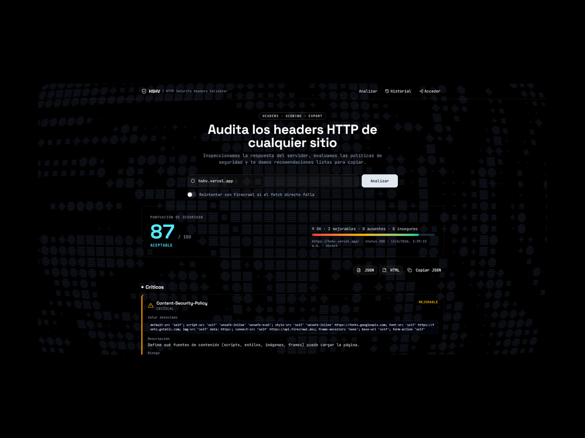

# hshv

> Analizador de headers HTTP con puntuación de seguridad y recomendaciones.

<!-- README-I18N:START -->

[English](./README.md) | **Español**

<!-- README-I18N:END -->

[](https://hshv.vercel.app/)
[](https://www.behance.net/ingfranciscastillo)
[](https://linkedin.com/in/ingfranciscastillo)
[](https://github.com/ingfranciscastillo/hshv/stargazers)
[](https://github.com/ingfranciscastillo/hshv/commits/main)



## Qué Hace Este Proyecto

Herramienta de análisis de seguridad para headers HTTP. Evalúa la configuración de seguridad de cualquier sitio web, genera puntuaciones detalladas y proporciona recomendaciones accionables para mejorar la protección.

## Tech Stack

- **Framework**: [TanStack Start](https://tanstack.com/start) - SSR con React Router
- **Auth**: [Better Auth](https://www.better-auth.com/) - Autenticación completa
- **Database**: [Drizzle ORM](https://orm.drizzle.team/) + PostgreSQL
- **Styling**: [Tailwind CSS v4](https://tailwindcss.com/) + [shadcn/ui](https://ui.shadcn.com/)
- **Validation**: [Zod](https://zod.dev/) - Esquemas de validación tipados

## Empezar

```bash
pnpm install
pnpm dev
```

## Funcionalidades

### Evaluación de Headers

Para cada header HTTP de seguridad, el sistema muestra:

| Campo | Descripción |
| ------- | ------------- |
| **Estado** | ✅ Seguro \| ⚠️ Mejorable \| ❌ Ausente \| 🚨 Inseguro |
| **Valor detectado** | El valor actual del header o "No detectado" |
| **Descripción técnica** | Explicación del propósito del header |
| **Impacto potencial** | Riesgos de seguridad si no está configurado |
| **Recomendación concreta** | Código exacto para corregir el problema |

**Ejemplo de evaluación:**

```text
Header: X-Frame-Options
Estado: ❌ Ausente

Descripción: Previene ataques de clickjacking.
Impacto: Un atacante podría cargar el sitio en un iframe malicioso.
Recomendación: X-Frame-Options: DENY
```

### Sistema de Puntuación

Genera una puntuación global de 0-100:

| Score | Nivel | Descripción |
|-------|-------|-------------|
| 0-39 | 🔴 Crítico | Configuración muy vulnerable |
| 40-69 | 🟡 Deficiente | Faltan medidas de seguridad esenciales |
| 70-89 | 🟢 Aceptable | Implementación básica correcta |
| 90-100 | ✨ Excelente | Configuración de seguridad óptima |

Incluye:

- Score total numérico
- Barra visual con gradiente de color
- Resumen ejecutivo del estado de seguridad

### Exportación

Descarga reportes en múltiples formatos:

- **HTML**: Reporte completo visualizable en cualquier navegador
- **JSON**: Datos estructurados para integración con otras herramientas

### Historial

Almacena los análisis realizados:

- Fecha y hora del análisis
- URL analizada
- Puntuación obtenida
- Accede a reportes previos rápidamente

### Dashboard

Panel de estadísticas:

- Total de análisis realizados
- Promedio de puntuaciones
- Headers más frecuentemente ausentes
- Tendencias de seguridad

## Aprender Más

- [TanStack Start](https://tanstack.com/start) - Documentación oficial
- [TanStack Router](https://tanstack.com/router) - Routing
- [TanStack Query](https://tanstack.com/query) - Gestión de estado server
- [Drizzle ORM](https://orm.drizzle.team/) - ORM tipado para PostgreSQL
- [Better Auth](https://www.better-auth.com/) - Autenticación
- [shadcn/ui](https://ui.shadcn.com/) - Componentes UI
